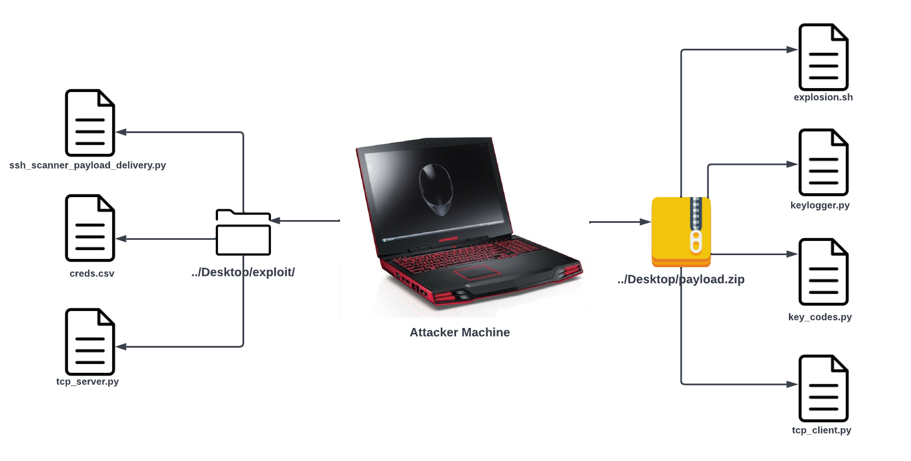

# Keylogger in the Background 

### Keylogger
A software that runs on a machine without user knowledge or permission. It captures user keystrokes, logs them and sends the logs back to the Attacker Machine.

### Demonstration

Inside ./exploit direcroty

1. `ssh_scanner_payload_delivery.py` The script runs a Brute Force Attack against an SSH server with provided credentials stored in a csv file
    1. `python3 ssh_scanner_payload_delivery.py <user credential CSV> <Target IP> <Target Port>`
3. `creds.csv` CSV file that contains user credentials
4. `tcp_server.py` The script receives key stroke log files from victim machine. 

Inside ./payload directory
1. `explosion.sh` Bash Script that runs necessary files to initiate the keylogger
    1. Installs Python
    2. Runs `keylogger.py` in the background
    3. Sets up a cronjob to run `tcp_client.py` in order to send the log files to the attacker machine.
2. `keylogger.py` The actual keylogger script
3. `key_codes.py` A Python dictionary mapping unique Byte Codes vs Keyboard Character
4. `tcp_client.py` Script that continuously sends generated user key stroke log files. Runs via cronjob.

[The demo is available here](https://www.youtube.com/watch?v=gFgk_dB6Jfo) 
